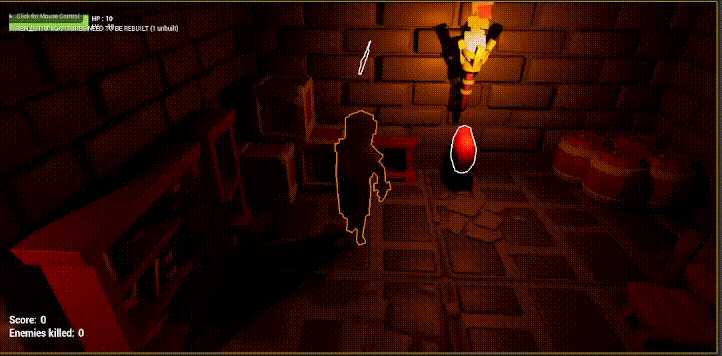
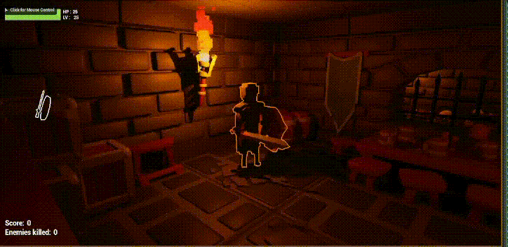

<div align="center">

# Dungeon Escapist
</div>

**This project aims at creating a 3D third-person brawler game in C++ language with UnrealEngine without the usage of Blueprints for gameplay logics.**<br/>
**The second goal of this project was to learn how to use UnrealEngine C++ API.**

## Information
Project start : 24/10/2022 <br>
Project end : 21/11/2022 <br>
Version : 1.0 - GOLD <br>
Date last version : 21/11/2022

## Building
## Create an executable
```sh
$ UnrealEngine > File > Package Project > Windows (64-bit)
```
## Run
```sh
$ UnrealEngine > Play Button or Start "UnrealBrawler.exe"
```
## Game Preview
# LEVEL DOOR
-> Close when entering in the arena to prevent player for getting back to safe zone, also protects win entrance
- 
# ENEMIES AI
- 

# GAME OVER MENU
- 
# GAME WIN MENU
- 
# GAME MAIN MENU
- 
# GAME PAUSE MENU
- 

# PLAYER HUD
-> Player hud containing the current score, the aount of enemy killed and the life bar with current hp and current level
- 

# SHIELD COLLECTIBLE
-> Shield object, protects from getting hit by enemies.
- 

# SHIELD V2 COLLECTIBLE
-> Shield object, protects the same  as shield sword, only skin changed.
- 

# SWORD COLLECTIBLE
-> Sword object, deals one damage per hit.
- 

# SWORD V2 COLLECTIBLE
-> Sword object, deals the same amount of damage as common sword, only skin changed.
- 

# TROPHEE
-> Discover a hidden room, pick it up to win the game!
- 

# HEART ANIMATIONS & COLLECTIBLE
-> Droped randomly when enemy killed, heals between 1 and 2 HP, rotating animation.
- 

# PLAYER ANIMATIONS
-> Showcase of blocking shield animation and attack sword animation.
- 

# BLOCKING ANIMATION + BLOOD SPLATER EFFECT + FOOTPRINTS
-> Showcase of blood splatter effect on hit + invincibility outline + sword bump when blocked
- 

# ROLL ANIMATION
-> Showcase of rool animation + invincibility when rolling
- 

## Asset Credits
---------------
- Thank to https://kaylousberg.com's assets that were on the free and available on their store!