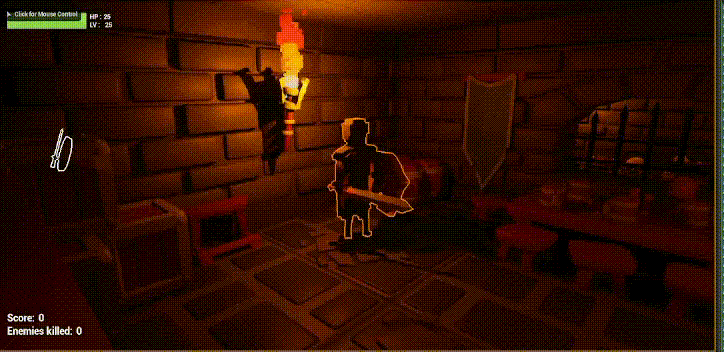
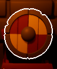
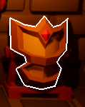
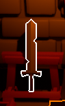
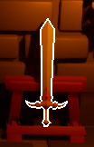
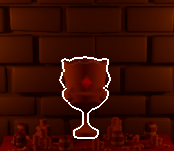

# Dungeon Escapist

### General Information

This project was made for the ISART Digital school by Rémi Serra and an anonymous collaborator. <br>
The goal was to create a 3D third-person brawler game in C++ using UnrealEngine with as little Blueprint code as possible.

<br>

## Preview

### Gameplay

<br>
<br>
<br>

### Weapons and Victory Trophee







<br>

## Asset Credits

Thanks to [kaylousberg](https://kaylousberg.com)'s free assets available on their store!

<br>

## Building
### Create an executable
```
UnrealEngine > File > Package Project > Windows (64-bit)
```
### Run
```
UnrealEngine > Play Button
```
